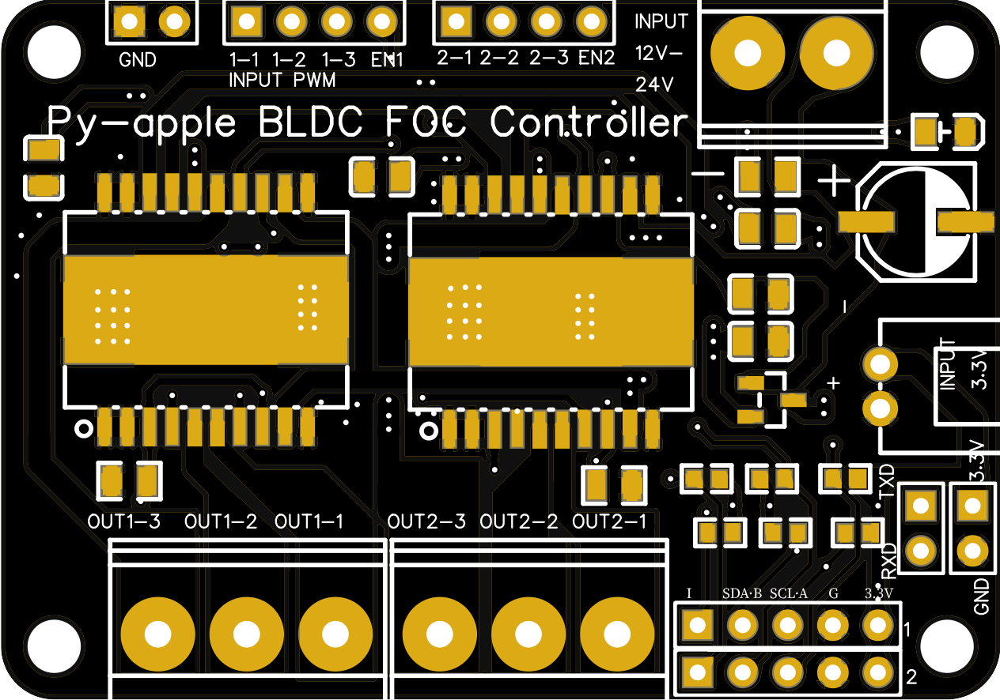
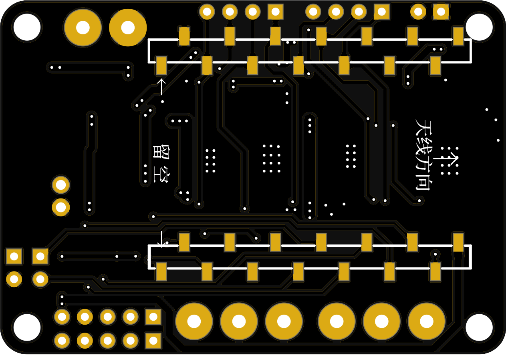

# ___PAFOC项目主标题___
## __PAFOC PAFOC集成板是一个由灯哥开源的，基于***开源协议和ESP32主控芯片的低成本无刷电机FOC驱动控制板。__

1. 特性
    * 支持双电机
    * 即插即用，原生支持EPS32模块，并预留3*2路PWM输入接口
    * 电压输入12-24V，最大电流？A
    * 集成编码器/霍尔传感器接口
    * 集成I2C，TXD接口
  
2. 规格

    | 说明       | 参数                            |
    | ------------ | --------------------------------- |
    | 尺寸       | 56*39 mm                          |
    | 输入电压类型 | 直流DC                          |
    | 输入电压 | 12-24V                            |
    | 最大输出电流 | ？                               |
    | 最大功率 | ？                               |
    | 支持电机数 | 2                                 |
    | 主控       | 底面可搭载ESP32开发板lolin32 lite |
    | 编码器支持 |                                   |
    | 拓展接口 |                                   |
    
3. 接口说明  
   仅针对于本项目所使用的ESP32开发板（型号为lolin32 lite,如下图）
   
   接口引脚如下：
   

   | 接口 | 功能 | 端口         |
   | -------- | ----- | ------------ |
   | 电机一 | 使能 | IO22         |
   |          | 输入 | IO32、33、25 |
   | 电机二 | 使能 | IO12         |
   |          | 输入 | IO26.27.14   |
   | 编码器一 | A/SCL | IO5          |
   |          | B/SDA | IO18         |
   |          | I     | IO15         |
   | 编码器二 | A/SCL | IO23         |
   |          | B/SDA | IO19         |
   |          | I     | IO13         |
   | 串口   | TXD   | IO17         |
   |          | RXD   | IO16         |
   ​         

4. 项目文件说明
    * Schematic：原理图
    * Gerber：gerber文件可以压缩后直接发给厂家直接打样
    * BOM：PCB元件清单
    * Test sample：简单测试例程